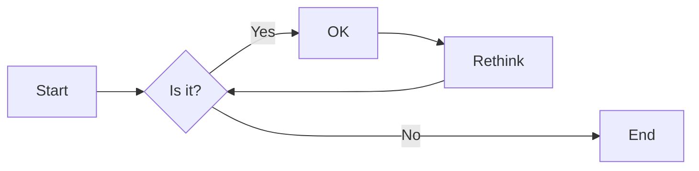

# Carte-Coco

TITLE: Calcul littéral
AUTHOR: Tiphaine GIRARD
DATE: 29/08/2022
---

# Identités remarquables

On utilise les 3 principales identités remarquables suivantes :

> $(a+b)²=a²+2ab+b²$
> 
> $(a-b)²=a²-2ab+b²$
> 
> $a²-b²=(a+b)(a-b)$
 
Par exemple :

$(2x+5)²=4x²+20x+25$

On peut aussi mettre des tableaux :
| Matière | Note |
| ---------- | ------ |
| Maths | 18 |
| Francais | 2 |

Ou écrire des trucs en **gras** ou en _italique_ ou ~~barrés~~

# Développement

Le développement consiste à écrire une équation uniquement sous forme de sommes ou de soustraction de termes.

$(a+b)(c-d)=ac+bc-ad-bd$

# Factorisation

La factorisation est l'inverse du développement, c'est à dire qu'on cherche à écrire l'équation sous forme de produits ou quotients de monomes.

$ac+bc-ad-bd=(a+b)(c-d)$

